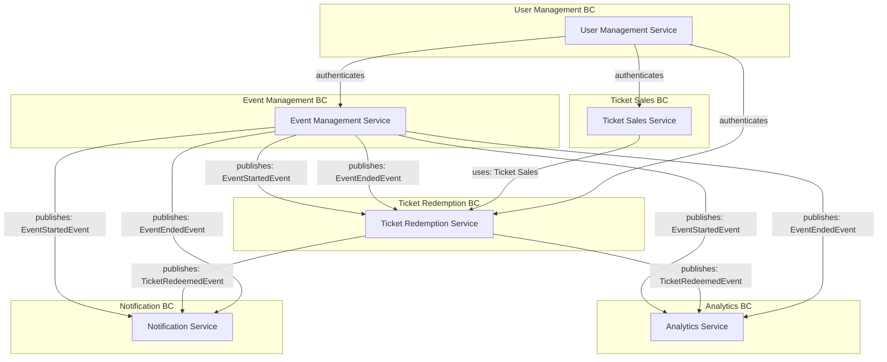
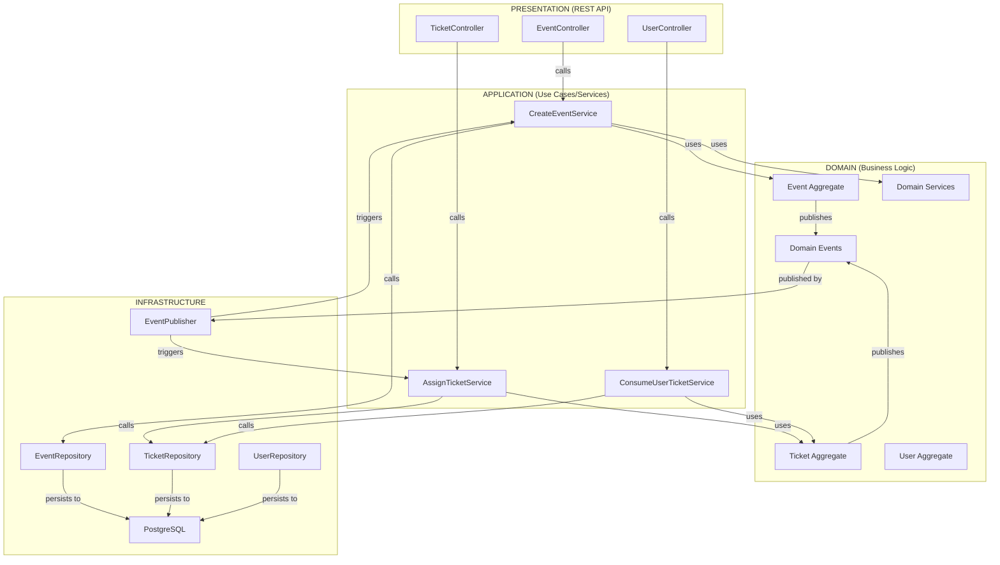

# Análise DDD e Clean Architecture - Arena.PE

## 1. SUBDOMÍNIOS

### 1.1 Subdomínios Identificados

| Subdomínio | Tipo | Gerador de Receita |
|------------|------|-------------------|
| **Event Management** | Core | ✅ SIM |
| **Ticket Sales & Distribution** | Core | ✅ SIM |
| **Event Discovery & Catalog** | Supporting | ❌ NÃO |
| **User & Authentication** | Supporting | ❌ NÃO |
| **Analytics & Statistics** | Supporting | ❌ NÃO |
| **Category Management** | Supporting | ❌ NÃO |

**Explicação:**
- **Event Management** gera receita pois está diretamente ligado à criação de eventos que comercializam ingressos
- **Ticket Sales & Distribution** gera receita através da venda de ingressos
- Os subdomínios **Supporting** são essenciais para o negócio mas não geram receita diretamente

---

## 2. BOUNDED CONTEXTS E SIGNIFICADO DE "CLIENTE"

### 2.1 Event Management Context
```
Responsabilidade: Criar, atualizar e gerenciar eventos
Cliente neste contexto: EVENT OWNER (Organizador/Promotor)
Significado: A pessoa que cria e organiza o evento
Exemplos de operações:
- createEvent(title, description, date, category, ticketSectors)
- updateEvent(eventId, details)
- cancelEvent(eventId)
- publishEvent(eventId)
```

### 2.2 Ticket Sales Context
```
Responsabilidade: Gerenciar modelos de ingresso, preços, disponibilidade e venda
Cliente neste contexto: TICKET BUYER (Comprador/Cliente Final)
Significado: A pessoa que compra/reserva ingressos para um evento
Exemplos de operações:
- purchaseTickets(ticketModelId, quantity, buyerEmail)
- validateTicketAvailability(ticketModelId, quantity)
- processPayment(purchase)
- reserveTickets(ticketModelId, quantity)
```

### 2.3 Event Discovery Context
```
Responsabilidade: Buscar, filtrar e exibir eventos disponíveis
Cliente neste contexto: SHOPPER (Espectador/Descobridor)
Significado: A pessoa que busca e descobre eventos para participar
Exemplos de operações:
- searchEvents(filters: category, date, location, keyword)
- getEventDetails(eventId)
- filterEventsByCategory(categoryId)
- listUpcomingEvents(date range)
```

### 2.4 Ticket Redemption Context
```
Responsabilidade: Validar e consumir ingressos no dia do evento
Cliente neste contexto: EVENT ATTENDEE (Participante/Público)
Significado: A pessoa presente no evento apresentando o ingresso
Exemplos de operações:
- redeemTicket(ticketId)
- validateTicket(ticketCode)
- cancelTicket(ticketId, reason)
- trackAttendance(eventId)
```

### 2.5 User Authentication & Management Context
```
Responsabilidade: Autenticação, autorização e gerenciamento de perfis
Cliente neste contexto: SYSTEM USER (Usuário do Sistema)
Significado: Qualquer pessoa com acesso ao sistema (pode ter múltiplos papéis)
Exemplos de operações:
- registerUser(name, email, password)
- authenticateUser(email, password)
- assignRole(userId, role)
- validatePermissions(userId, resource)
```

---

## 3. AGREGADOS, ENTIDADES E INVARIANTES

### 3.1 Event Management Context - Agregado: EVENT

```
┌─────────────────────────────────────┐
│      EVENT AGGREGATE ROOT           │
├─────────────────────────────────────┤
│ ID: UUID                            │
│ title: String                       │
│ description: String                 │
│ eventDate: LocalDateTime            │
│ status: EventStatus                 │
│ imageUrl: String                    │
│ creator: User (reference)           │
│ category: Category (reference)      │
│ active: Boolean                     │
│                                     │
│ Entidades Filhas:                   │
│ - TicketModel[] (compõem o evento)  │
│ - UserTicket[] (vendas do evento)   │
└─────────────────────────────────────┘

INVARIANTES DO AGREGADO EVENT:
✓ eventDate DEVE ser no futuro quando criado
✓ title DEVE ser único na plataforma
✓ title DEVE ter entre 3 e 150 caracteres
✓ description DEVE ter entre 10 e 1000 caracteres
✓ creator DEVE ser um usuário válido (NOT NULL)
✓ Um evento SÓ pode ter TicketModels (não pode estar órfão)
✓ Status: apenas transições válidas (UPCOMING → ONGOING → COMPLETED ou CANCELED)
✓ Quando status muda para COMPLETED, NÃO pode mais vender tickets
✓ Quando status muda para CANCELED, todos os tickets DEVEM ser cancelados
✓ active = true significa evento disponível para venda
✓ Se active = false, NÃO pode vender novos tickets
✓ imageUrl DEVE ser válida

REGRAS DE NEGÓCIO PROTEGIDAS:
• Um evento só pode ser criado por um usuário autenticado
• Um evento não pode ser alterado após ter começado
• Não pode haver dois eventos com o mesmo título
• Um evento precisa ter pelo menos um TicketModel antes de ser publicado
```

### 3.2 Ticket Sales Context - Agregado: TICKET MODEL

```
┌──────────────────────────────────┐
│  TICKET MODEL AGGREGATE ROOT      │
├──────────────────────────────────┤
│ ID: UUID                         │
│ event: Event (reference)         │
│ ticketLocation: TicketLocation   │ (enum: PISTA, VIP, CAMAROTE)
│ price: Double                    │
│ ticketsAvailable: Integer        │
│ ticketsSold: Integer             │
│ expired: Boolean                 │
│                                  │
│ Entidades Filhas:                │
│ - UserTicket[] (ingressos vendidos) │
└──────────────────────────────────┘

INVARIANTES DO AGREGADO TICKET MODEL:
✓ price > 0 (SEMPRE deve ser positivo)
✓ ticketsAvailable >= 1 (DEVE haver pelo menos 1 ingresso)
✓ ticketsSold >= 0 e ticketsSold <= ticketsAvailable
✓ ticketsAvailable - ticketsSold = ingressos realmente disponíveis
✓ event DEVE ser válido (NOT NULL) e status UPCOMING
✓ Cada location (PISTA, VIP, CAMAROTE) é única por evento
✓ Um TicketModel SÓ pode ser criado quando o Event está em UPCOMING
✓ Não pode modificar price após ter vendido tickets
✓ Não pode reduzir ticketsAvailable abaixo de ticketsSold

REGRAS DE NEGÓCIO PROTEGIDAS:
• Garante que não há venda de ingressos sem disponibilidade
• Garante integridade dos preços (não pode mudar mid-sale)
• Garante que cada setor do evento tem configuração única
• Quando ticketsSold atinge ticketsAvailable, setor está SOLD OUT
```

### 3.3 Ticket Redemption Context - Agregado: USER TICKET

```
┌────────────────────────────────┐
│   USER TICKET AGGREGATE ROOT    │
├────────────────────────────────┤
│ ID: UUID                       │
│ user: User (reference)         │
│ event: Event (reference)       │
│ ticketModel: TicketModel (ref) │
│ status: TicketStatus           │
│ createdAt: LocalDateTime       │
│ updatedAt: LocalDateTime       │
└────────────────────────────────┘

INVARIANTES DO AGREGADO USER TICKET:
✓ user DEVE ser válido (NOT NULL)
✓ event DEVE ser válido (NOT NULL)
✓ ticketModel DEVE ser válido (NOT NULL)
✓ Status inicial SEMPRE é VALIDO
✓ Transições de status válidas:
   - VALIDO → RESGATADO (apenas no dia do evento)
   - VALIDO → CANCELADO (antes do evento)
   - VALIDO → EXPIRADO (após data do evento)
   - RESGATADO → não pode mudar
   - CANCELADO → não pode mudar
   - EXPIRADO → não pode mudar
✓ Um ingresso SÓ pode ser resgatado UMA VEZ
✓ Um ingresso SÓ pode ser cancelado UMA VEZ
✓ Cada user/ticketModel no mesmo evento = 1 ingresso

REGRAS DE NEGÓCIO PROTEGIDAS:
• Garante que um ingresso só é consumido uma vez
• Garante que só o dono ou admin pode cancelar
• Garante que ingressos expirados não podem ser resgatados
• Garante rastreabilidade completa: quem, quando, status
```

### 3.4 User Management Context - Agregado: USER

```
┌─────────────────────────────────┐
│     USER AGGREGATE ROOT         │
├─────────────────────────────────┤
│ ID: UUID                        │
│ name: String                    │
│ email: String (unique)          │
│ password: String (hash)         │
│ role: Role                      │ (CUSTOMER, ADMIN)
│ createdAt: LocalDateTime        │
│ updatedAt: LocalDateTime        │
│                                 │
│ Entidades Filhas:               │
│ - Event[] (eventos criados)     │
│ - UserTicket[] (ingressos owned)│
└─────────────────────────────────┘

INVARIANTES DO AGREGADO USER:
✓ email DEVE ser único na plataforma
✓ email DEVE ser válido (formato de email)
✓ name DEVE ter conteúdo (NOT BLANK)
✓ password DEVE ser hashed (nunca plain-text)
✓ role DEVE ser válido (CUSTOMER ou ADMIN)
✓ Uma user SÓ pode ter UM role por vez
✓ Apenas ADMINs podem cancelar tickets de outros usuários

REGRAS DE NEGÓCIO PROTEGIDAS:
• Um usuário não pode ter dois emails iguais
• Um usuário só pode fazer login com email e senha válidos
• Apenas um usuário com role=ADMIN pode fazer certas operações
• Senha deve ser protegida (hashed com bcrypt)
```

---

## 4. EVENTOS DO DIA DO SHOW

### Cenário: 15 de Outubro de 2024 - Dia do Evento

#### **EVENTO 1: EventStartedEvent**

```
┌────────────────────────────────────────────┐
│  EVENT: EventStartedEvent                  │
├────────────────────────────────────────────┤
│ Payload:                                   │
│  - eventId: UUID                           │
│  - eventTitle: String                      │
│  - startedAt: LocalDateTime                │
│  - expectedEndTime: LocalDateTime          │
│  - location: String                        │
│  - totalAttendees: Integer                 │
│                                            │
│ PUBLISHER: EventService                    │
│           (Serviço que gerencia eventos)   │
│                                            │
│ CONSUMERS:                                 │
│  1. TicketRedemptionService                │
│     → Inicia processo de validação de      │
│       ingressos na entrada                 │
│                                            │
│  2. StatisticsService                      │
│     → Registra que evento começou          │
│     → Inicia tracking de participação      │
│                                            │
│  3. NotificationService                    │
│     → Envia notificação aos participantes  │
│       "Evento começando agora!"             │
│                                            │
│ TIMING: 14:00 (hora de início do evento)   │
│ TRIGGER: Admin clica em "Iniciar Evento"   │
└────────────────────────────────────────────┘

Pseudocódigo:
```
class EventStartedEvent implements DomainEvent {
  - eventId: UUID
  - startedAt: LocalDateTime
  - location: String
  
  publishedBy: EventService.startEvent(eventId)
  
  subscribers:
    TicketRedemptionService.onEventStarted(event)
    StatisticsService.recordEventStart(event)
    NotificationService.notifyParticipants(event)
}
```
```

#### **EVENTO 2: TicketRedeemedEvent**

```
┌────────────────────────────────────────────┐
│  EVENT: TicketRedeemedEvent                │
├────────────────────────────────────────────┤
│ Payload:                                   │
│  - ticketId: UUID                          │
│  - userId: UUID                            │
│  - userName: String                        │
│  - eventId: UUID                           │
│  - sectorLocation: TicketLocation          │
│  - redeemedAt: LocalDateTime               │
│  - qrCode: String                          │
│                                            │
│ PUBLISHER: TicketRedemptionService         │
│           (Serviço de resgate/validação)   │
│                                            │
│ CONSUMERS:                                 │
│  1. UserTicketRepository                   │
│     → Atualiza status para RESGATADO       │
│                                            │
│  2. StatisticsService                      │
│     → Incrementa contador de presença      │
│     → Atualiza taxa de ocupação por setor  │
│     → Calcula receita em tempo real        │
│                                            │
│  3. GateAccessService                      │
│     → Permite/nega acesso na catraca       │
│     → Registra horário de entrada          │
│                                            │
│  4. NotificationService                    │
│     → Envia confirmação ao participante    │
│       "Bem-vindo! Ingresso validado"       │
│                                            │
│ TIMING: Contínuo durante o evento          │
│         (cada vez que alguém entra)        │
│ FREQUENCY: ~500 eventos/hora               │
│           (dependendo do evento)           │
└────────────────────────────────────────────┘

Pseudocódigo:
```
class TicketRedeemedEvent implements DomainEvent {
  - ticketId: UUID
  - userId: UUID
  - eventId: UUID
  - redeemedAt: LocalDateTime
  - sectorLocation: TicketLocation
  
  publishedBy: TicketRedemptionService.redeemTicket(ticketId)
  
  subscribers:
    UserTicketRepository.updateStatus(ticketId, RESGATADO)
    StatisticsService.recordAttendance(event)
    GateAccessService.permitEntry(ticket)
    NotificationService.confirmEntry(user)
}
```
```

#### **EVENTO 3: EventEndedEvent**

```
┌────────────────────────────────────────────┐
│  EVENT: EventEndedEvent                    │
├────────────────────────────────────────────┤
│ Payload:                                   │
│  - eventId: UUID                           │
│  - eventTitle: String                      │
│  - endedAt: LocalDateTime                  │
│  - totalAttendees: Integer                 │
│  - totalReceived: Double                   │
│  - occupancyRate: Double                   │
│  - sectorStats: Map<Sector, Stats>         │
│                                            │
│ PUBLISHER: EventService                    │
│           (Serviço que gerencia eventos)   │
│                                            │
│ CONSUMERS:                                 │
│  1. TicketRedemptionService                │
│     → Encerra processo de validação        │
│     → Marca ingressos não consumidos como  │
│       EXPIRADO                             │
│                                            │
│  2. StatisticsService                      │
│     → Registra evento como COMPLETED       │
│     → Calcula relatório final de           │
│       attendance e receita                 │
│     → Calcula taxa de conversão            │
│       (tickets vendidos/presentes)         │
│                                            │
│  3. ReportingService                       │
│     → Gera relatório para organizador      │
│     → Prepara dados para analytics         │
│     → Arquiva evento e dados               │
│                                            │
│  4. NotificationService                    │
│     → Envia obrigado aos participantes     │
│     → Oferece feedback form                │
│     → Informa organizador: "Evento OK"     │
│                                            │
│ TIMING: 23:59 (fim da programação)         │
│ TRIGGER: Admin clica em "Finalizar Evento"│
│         OU sistema automaticamente após    │
│         tempo limite                       │
└────────────────────────────────────────────┘

Pseudocódigo:
```
class EventEndedEvent implements DomainEvent {
  - eventId: UUID
  - endedAt: LocalDateTime
  - totalAttendees: Integer
  - totalReceived: Double
  - occupancyRate: Double
  
  publishedBy: EventService.endEvent(eventId)
  
  subscribers:
    TicketRedemptionService.onEventEnded(event)
    StatisticsService.recordEventEnd(event)
    ReportingService.generateReport(event)
    NotificationService.sendFinalNotifications(event)
}
```
```

---

## 5. DIAGRAMA DE BOUNDED CONTEXTS E EVENTOS



---

## 6. CLEAN ARCHITECTURE - ESTRUTURA DE CAMADAS

### 6.1 Visão Geral da Clean Architecture

```
┌────────────────────────────────────────────────────────┐
│                    PRESENTATION LAYER                  │
│              (Controllers, DTOs, Responses)            │
│                                                        │
│  EventController  TicketController  UserController    │
│  ReservationAPI   StatisticsAPI     CategoryAPI        │
└────────────────────────────────────────────────────────┘
                           ↓↑
┌────────────────────────────────────────────────────────┐
│                 APPLICATION LAYER                      │
│            (Use Cases, Services, Interfaces)           │
│                                                        │
│  CreateEventUseCase    AssignTicketUseCase            │
│  GetEventsUseCase      ConsumeTicketUseCase           │
│  CreateTicketUseCase   CancelTicketUseCase            │
└────────────────────────────────────────────────────────┘
                           ↓↑
┌────────────────────────────────────────────────────────┐
│               DOMAIN LAYER (Business Rules)            │
│     (Entities, Value Objects, Aggregates, Interfaces)  │
│                                                        │
│  Event       User        Category                      │
│  Ticket      UserTicket   TicketModel                  │
│  Events      Services     ValueObjects                 │
└────────────────────────────────────────────────────────┘
                           ↓↑
┌────────────────────────────────────────────────────────┐
│            INFRASTRUCTURE LAYER                        │
│     (Repositories, Persistence, External Services)    │
│                                                        │
│  EventRepository       PostgreSQL                      │
│  TicketRepository      JWT Auth                        │
│  UserRepository        File Upload Service            │
│  CategoryRepository    Email Service                   │
└────────────────────────────────────────────────────────┘
```

### 6.2 Estrutura de Pasta Proposta para Arena.PE

```
arena-pe-backend/
│
├── src/main/java/com/ffqts/arenape/
│   │
│   ├── presentation/                    # CAMADA DE APRESENTAÇÃO
│   │   ├── controllers/
│   │   │   ├── EventController.java
│   │   │   ├── TicketController.java
│   │   │   ├── UserController.java
│   │   │   ├── ReservationController.java
│   │   │   └── StatisticsController.java
│   │   │
│   │   ├── dto/                        # Data Transfer Objects
│   │   │   ├── event/
│   │   │   │   ├── CreateEventRequest.java
│   │   │   │   ├── EventResponse.java
│   │   │   │   └── UpdateEventRequest.java
│   │   │   ├── ticket/
│   │   │   │   ├── CreateTicketRequest.java
│   │   │   │   ├── TicketResponse.java
│   │   │   │   └── RedeemedTicketResponse.java
│   │   │   ├── user/
│   │   │   │   ├── RegisterUserRequest.java
│   │   │   │   └── UserResponse.java
│   │   │   └── reservation/
│   │   │       ├── CreateReservationRequest.java
│   │   │       └── ReservationResponse.java
│   │   │
│   │   ├── mappers/                   # DTO ↔ Domain Mappers
│   │   │   ├── EventMapper.java
│   │   │   ├── TicketMapper.java
│   │   │   └── UserMapper.java
│   │   │
│   │   └── utils/
│   │       └── ApiResponse.java
│   │
│   ├── application/                    # CAMADA DE APLICAÇÃO
│   │   ├── event/                     # Event Use Cases
│   │   │   ├── CreateEventService.java
│   │   │   ├── UpdateEventService.java
│   │   │   ├── GetEventsService.java
│   │   │   ├── GetUserPurchasedEventsService.java
│   │   │   └── DeleteEventService.java
│   │   │
│   │   ├── tickets/                   # Ticket Use Cases
│   │   │   ├── model/
│   │   │   │   ├── CreateTicketModelService.java
│   │   │   │   ├── UpdateTicketModelService.java
│   │   │   │   ├── GetTicketModelsService.java
│   │   │   │   └── DeactivateTicketModelService.java
│   │   │   │
│   │   │   └── user/
│   │   │       ├── AssignUserTicketsService.java    # Compra
│   │   │       ├── ConsumeUserTicketService.java    # Resgate
│   │   │       ├── CancelUserTicketService.java     # Cancelamento
│   │   │       └── GetUserTicketsService.java       # Consulta
│   │   │
│   │   ├── auth/
│   │   │   ├── AuthenticationService.java
│   │   │   ├── TokenService.java
│   │   │   └── PasswordEncoderService.java
│   │   │
│   │   ├── category/
│   │   │   ├── CreateCategoryService.java
│   │   │   ├── GetCategoryService.java
│   │   │   └── ListCategoriesService.java
│   │   │
│   │   ├── statistics/
│   │   │   ├── CalculateEventStatisticsService.java
│   │   │   ├── CalculateTicketSalesService.java
│   │   │   └── GenerateReportService.java
│   │   │
│   │   └── utils/
│   │       └── ValidationService.java
│   │
│   ├── domain/                         # CAMADA DE DOMÍNIO
│   │   ├── models/                    # Entidades & Value Objects
│   │   │   ├── event/
│   │   │   │   ├── Event.java         # AGREGADO RAIZ
│   │   │   │   ├── EventStatus.java   # Value Object (Enum)
│   │   │   │   └── Category.java      # Entidade Filha
│   │   │   │
│   │   │   ├── ticket/
│   │   │   │   ├── TicketModel.java   # AGREGADO RAIZ
│   │   │   │   ├── UserTicket.java    # AGREGADO RAIZ
│   │   │   │   ├── TicketStatus.java  # Value Object (Enum)
│   │   │   │   ├── TicketLocation.java # Value Object (Enum)
│   │   │   │   └── TicketPrice.java   # Value Object
│   │   │   │
│   │   │   ├── user/
│   │   │   │   ├── User.java          # AGREGADO RAIZ
│   │   │   │   └── Role.java          # Value Object (Enum)
│   │   │   │
│   │   │   └── BaseEntity.java        # Base para todas entidades
│   │   │
│   │   ├── services/                  # Domain Services (lógica cross-agregado)
│   │   │   ├── event/
│   │   │   │   └── ICreateEvent.java  # Interface de contrato
│   │   │   │
│   │   │   ├── tickets/
│   │   │   │   ├── model/
│   │   │   │   │   └── ICreateTicketModel.java
│   │   │   │   │
│   │   │   │   └── user/
│   │   │   │       ├── IAssignUserTicketsService.java
│   │   │   │       ├── IConsumeUserTicketService.java
│   │   │   │       └── ICancelUserTicketService.java
│   │   │   │
│   │   │   ├── category/
│   │   │   │   └── ICategoryService.java
│   │   │   │
│   │   │   └── auth/
│   │   │       └── IAuthService.java
│   │   │
│   │   ├── events/                    # Domain Events (publicados)
│   │   │   ├── DomainEvent.java       # Interface base
│   │   │   ├── EventStartedEvent.java
│   │   │   ├── TicketRedeemedEvent.java
│   │   │   ├── EventEndedEvent.java
│   │   │   ├── TicketCancelledEvent.java
│   │   │   └── EventCreatedEvent.java
│   │   │
│   │   └── repositories/              # Repository Interfaces (abstrações)
│   │       ├── IEventRepository.java
│   │       ├── ITicketModelRepository.java
│   │       ├── IUserTicketRepository.java
│   │       ├── IUserRepository.java
│   │       └── ICategoryRepository.java
│   │
│   └── infrastructure/                 # CAMADA DE INFRAESTRUTURA
│       ├── repositories/              # Implementações de Repositories
│       │   ├── EventRepository.java
│       │   ├── TicketModelRepository.java
│       │   ├── UserTicketRepository.java
│       │   ├── UserRepository.java
│       │   └── CategoryRepository.java
│       │
│       ├── persistence/
│       │   ├── jpa/
│       │   │   └── JpaEventRepository.java (Spring Data JPA)
│       │   │
│       │   └── postgresql/
│       │       ├── EventTableSchema.sql
│       │       ├── TicketTableSchema.sql
│       │       └── UserTableSchema.sql
│       │
│       ├── security/
│       │   ├── SecurityConfig.java
│       │   ├── SecurityFilter.java
│       │   ├── JwtTokenProvider.java
│       │   └── PasswordEncoder.java
│       │
│       ├── external/
│       │   ├── EmailService.java      # Integração com provedor email
│       │   ├── PaymentService.java    # Integração com gateway pagamento
│       │   └── FileStorageService.java # AWS S3 / local storage
│       │
│       ├── messaging/                 # Event Publishing
│       │   ├── DomainEventPublisher.java
│       │   ├── EventListener.java
│       │   └── EventSubscriber.java
│       │
│       └── config/
│           ├── ApplicationConfig.java
│           ├── JpaConfig.java
│           └── SecurityConfig.java
│
├── pom.xml
├── application.properties
└── docker-compose.yml
```

### 6.3 Fluxo de Dados Entre Camadas

#### Exemplo: Criar Evento

```
1. PRESENTATION LAYER (Controller)
   └─ EventController.createEvent(CreateEventRequest)
   
2. APPLICATION LAYER (Use Case)
   └─ CreateEventService.create(...)
   
3. DOMAIN LAYER (Business Logic)
   ├─ Event.new(title, description, ...)  // Cria agregado
   ├─ Validações (invariantes)
   └─ Publica: EventCreatedEvent
   
4. INFRASTRUCTURE LAYER
   ├─ EventRepository.save(event)         // Persiste no BD
   ├─ DomainEventPublisher.publish()      // Publica eventos
   └─ Retorna para Application
   
5. APPLICATION LAYER
   └─ Retorna resultado
   
6. PRESENTATION LAYER
   └─ Retorna EventResponse ao cliente
```

---

## 7. LISTA DE AGREGADOS COM INVARIANTES

| Agregado | Raiz | Entidades Filhas | Invariantes Críticas |
|----------|------|------------------|----------------------|
| **Event** | Event.java | TicketModel, UserTicket | eventDate > now(), title unique, creator NOT NULL, status transitions válidas |
| **TicketModel** | TicketModel.java | UserTicket | price > 0, ticketsAvailable >= 1, ticketsSold <= ticketsAvailable |
| **UserTicket** | UserTicket.java | - | user/event/ticketModel NOT NULL, status transitions válidas, só resgata uma vez |
| **User** | User.java | Event[], UserTicket[] | email unique, email valid, role MUST be set |
| **Category** | Category.java | Event[] | title NOT BLANK |

---

## 8. TABELA DE DOMAIN EVENTS

| Evento | Publicador | Consumidores | Contexto | Timing |
|--------|-----------|--------------|---------|--------|
| **EventCreatedEvent** | EventService | AnalyticsService, NotificationService | Event Management | Imediato após criação |
| **EventStartedEvent** | EventService | TicketRedemptionService, AnalyticsService, NotificationService | Event Management | Início do evento (14:00) |
| **TicketRedeemedEvent** | TicketRedemptionService | AnalyticsService, GateAccessService, NotificationService | Ticket Redemption | Contínuo durante evento |
| **EventEndedEvent** | EventService | TicketRedemptionService, AnalyticsService, ReportingService, NotificationService | Event Management | Fim do evento (23:59) |
| **TicketCancelledEvent** | TicketRedemptionService | AnalyticsService, NotificationService | Ticket Redemption | Sob demanda |
| **TicketPurchasedEvent** | TicketSalesService | AnalyticsService, NotificationService | Ticket Sales | Imediato após compra |

---

## 9. CONEXÃO COM SPRING BOOT (Framework Utilizado)

### 9.1 Mapeamento da Clean Architecture para Spring Boot

```
DOMAIN LAYER
├─ @Entity (JPA) - Entidades do domínio
├─ @Embeddable - Value Objects
└─ Domain Services (interfaces)

APPLICATION LAYER
├─ @Service - Application Services (Use Cases)
└─ @Transactional - Gerenciamento de transações

INFRASTRUCTURE LAYER
├─ @Repository (Spring Data JPA)
├─ @Configuration - Configurações do Spring
├─ @Component - Beans gerais
└─ @Bean - Definições customizadas

PRESENTATION LAYER
├─ @RestController - Controllers REST
├─ @RequestMapping - Rotas
└─ @Valid - Validação DTOs
```

### 9.2 Exemplo de Fluxo Real no Spring Boot

```java
// 1. PRESENTATION
@RestController
@RequestMapping("/api/events")
public class EventController {
    @PostMapping
    public ResponseEntity<EventResponse> create(@Valid @RequestBody CreateEventRequest req) {
        EventResponse response = createEventService.create(req);
        return ResponseEntity.ok(response);
    }
}

// 2. APPLICATION
@Service
public class CreateEventService implements ICreateEvent {
    @Transactional
    public EventResponse create(CreateEventRequest req) {
        // Validações
        // Chama domain service
        Event event = eventDomainService.create(...);
        // Persiste
        eventRepository.save(event);
        // Publica eventos de domínio
        eventPublisher.publish(event.getDomainEvents());
        // Mapeia para DTO
        return eventMapper.toResponse(event);
    }
}

// 3. DOMAIN
@Entity
public class Event extends BaseEntity {
    // Invariantes protegidas em getters/setters
    public void setTitle(String title) {
        if (title.length() < 3) throw new InvalidTitleException();
        this.title = title;
    }
}

// 4. INFRASTRUCTURE
@Repository
public interface EventRepository extends JpaRepository<Event, UUID> {
    Optional<Event> findByTitle(String title);
}

// Domain Event Publishing
@Component
public class DomainEventPublisher {
    @Autowired
    private ApplicationEventPublisher publisher;
    
    public void publish(List<DomainEvent> events) {
        events.forEach(e -> publisher.publishEvent(e));
    }
}

// Event Listener
@Component
public class EventListeners {
    @EventListener
    public void onEventCreated(EventCreatedEvent event) {
        // Notifica usuários
        // Atualiza analytics
    }
}
```

---

## 10. DIAGRAMA MERMAID - CLEAN ARCHITECTURE



---

## 11. MATRIZ DE RESPONSABILIDADES (RACI)

| Operação | Presentation | Application | Domain | Infrastructure |
|----------|--------------|-------------|--------|-----------------|
| Receber Input HTTP | **Responsible** | - | - | - |
| Validar Formato DTO | **Accountable** | Support | - | - |
| Aplicar Regras de Negócio | - | - | **Responsible** | - |
| Persistir Dados | - | - | - | **Responsible** |
| Publicar Eventos | - | Coordinate | **Responsible** | Execute |
| Fazer Cache | - | - | - | **Responsible** |
| Autenticação | - | **Coordinate** | - | **Execute** |
| Log/Auditoria | Support | Support | Support | **Responsible** |

---

## 12. CONCLUSÃO

O projeto Arena.PE está bem estruturado seguindo uma arquitetura em camadas próxima à Clean Architecture. Para atingir excelência, recomenda-se:

1. **Segregar explicitamente** os módulos/projetos por bounded context
2. **Implementar Domain Events** de forma mais robusta
3. **Criar interfaces** de serviços de domínio mais claras
4. **Documentar invariantes** dentro das entidades
5. **Aplicar Value Objects** para tipos primitivos (Price, Email, etc)
6. **Implementar pattern Strategy** para diferentes tipos de promoções
7. **Usar Event Sourcing** para auditoria completa de tickets

