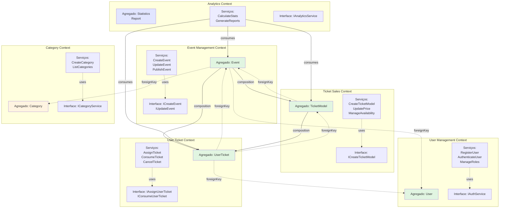
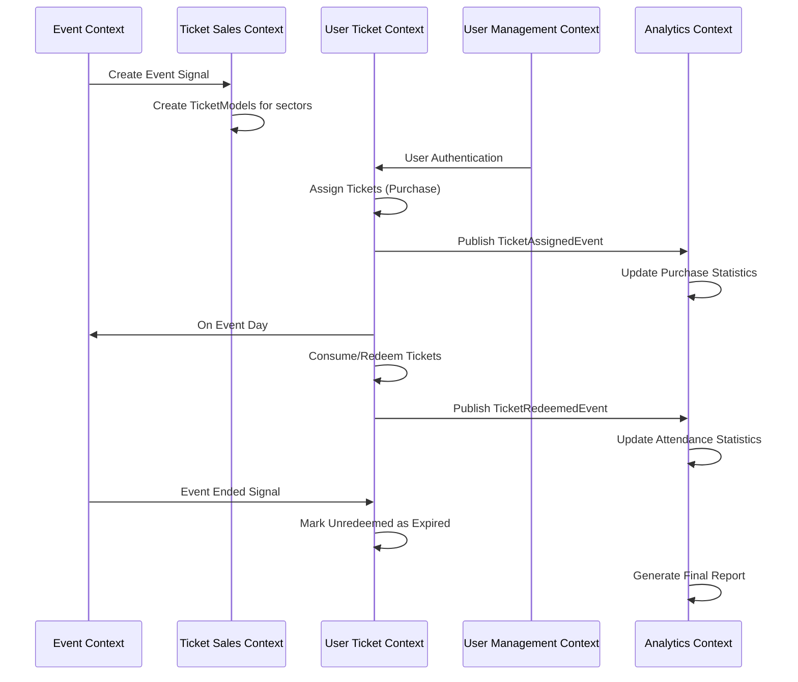
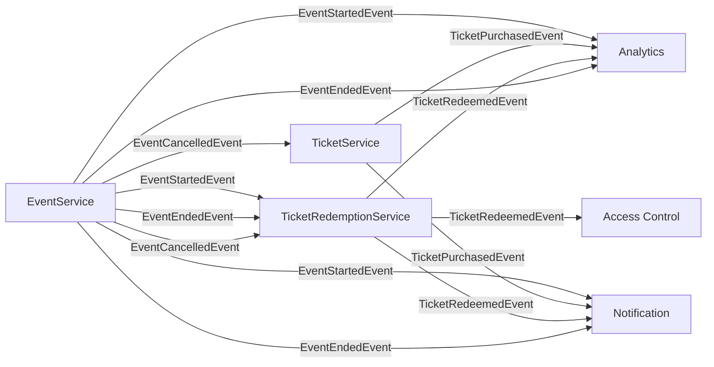

# Diagramas e Estrutura - Arena.PE

## ÍNDICE
1. [Diagrama de Bounded Contexts](#1-diagrama-de-bounded-contexts)
2. [Lista de Agregados com Invariantes](#2-lista-de-agregados-com-invariantes)
3. [Tabela de Domain Events](#3-tabela-de-domain-events)
4. [Estrutura de Pastas Clean Architecture](#4-estrutura-de-pastas-clean-architecture)

---

## 1. DIAGRAMA DE BOUNDED CONTEXTS

### 1.1 Mapa de Contextos Delimitados



### 1.2 Comunicação entre Contextos



---

## 2. LISTA DE AGREGADOS COM INVARIANTES

### 2.1 Agregado: EVENT

```
╔════════════════════════════════════════════════════════════╗
║ AGREGADO RAIZ: Event                                       ║
╠════════════════════════════════════════════════════════════╣
║ ID: UUID                                                   ║
║ title: String                                              ║
║ description: String                                        ║
║ eventDate: LocalDateTime                                   ║
║ status: EventStatus (UPCOMING | ONGOING | COMPLETED | CANCELED) ║
║ imageUrl: String                                           ║
║ creator: User (reference)                                  ║
║ category: Category (reference)                             ║
║ active: Boolean                                            ║
║                                                            ║
║ COMPOSIÇÕES:                                               ║
║ ├─ TicketModel[] (1..*)                                    ║
║ └─ UserTicket[] (0..*)                                     ║
╠════════════════════════════════════════════════════════════╣
║ INVARIANTES:                                               ║
╠════════════════════════════════════════════════════════════╣
║ I1  | eventDate > LocalDateTime.now()                      ║
║ I2  | title ≠ null ∧ length(title) ∈ [3, 150]            ║
║ I3  | description ≠ null ∧ length(desc) ∈ [10, 1000]     ║
║ I4  | creator ≠ null ∧ creator.isValid()                  ║
║ I5  | TicketModels.size() ≥ 1                             ║
║ I6  | status ∈ {UPCOMING, ONGOING, COMPLETED, CANCELED}   ║
║ I7  | Se status = COMPLETED → eventDate < now()           ║
║ I8  | Se status = CANCELED → todos UserTickets cancelados ║
║ I9  | active = true ↔ status = UPCOMING                   ║
║ I10 | imageUrl ≠ null ∧ isValidUrl(imageUrl)              ║
║ I11 | Título é UNIQUE na plataforma                       ║
╠════════════════════════════════════════════════════════════╣
║ REGRAS DE NEGÓCIO PROTEGIDAS:                              ║
╠════════════════════════════════════════════════════════════╣
║ RN1 | Evento só pode ser criado por User autenticado       ║
║ RN2 | Evento não pode ser editado após ter começado        ║
║ RN3 | Evento precisa ≥1 TicketModel para ser publicado     ║
║ RN4 | Cancelar evento → refundar todos os tickets vendidos ║
║ RN5 | Só admin pode cancelar evento já iniciado            ║
╚════════════════════════════════════════════════════════════╝
```

### 2.2 Agregado: TICKET MODEL

```
╔════════════════════════════════════════════════════════════╗
║ AGREGADO RAIZ: TicketModel                                 ║
╠════════════════════════════════════════════════════════════╣
║ ID: UUID                                                   ║
║ event: Event (reference)                                   ║
║ ticketLocation: TicketLocation (PISTA | VIP | CAMAROTE)   ║
║ price: Double                                              ║
║ ticketsAvailable: Integer                                  ║
║ ticketsSold: Integer                                       ║
║ expired: Boolean                                           ║
║                                                            ║
║ COMPOSIÇÕES:                                               ║
║ └─ UserTicket[] (0..*)                                     ║
╠════════════════════════════════════════════════════════════╣
║ INVARIANTES:                                               ║
╠════════════════════════════════════════════════════════════╣
║ I1  | price > 0                                            ║
║ I2  | ticketsAvailable ≥ 1                                 ║
║ I3  | ticketsSold ≥ 0                                      ║
║ I4  | ticketsSold ≤ ticketsAvailable                       ║
║ I5  | ticketsReais = ticketsAvailable - ticketsSold > 0    ║
║ I6  | event ≠ null ∧ event.status = UPCOMING               ║
║ I7  | ticketLocation ∈ {PISTA, VIP, CAMAROTE}             ║
║ I8  | Por evento: (ticketLocation) é UNIQUE               ║
║ I9  | Se ticketsSold > 0 → preço ≠ pode mudar             ║
║ I10 | ticketsAvailable ≥ ticketsSold (sempre)             ║
║ I11 | Se expired = true → nenhuma venda nova              ║
╠════════════════════════════════════════════════════════════╣
║ REGRAS DE NEGÓCIO PROTEGIDAS:                              ║
╠════════════════════════════════════════════════════════════╣
║ RN1 | Não pode vender mais tickets que disponível          ║
║ RN2 | Preço não pode mudar após primeira venda             ║
║ RN3 | Cada setor é ÚNICO por evento                        ║
║ RN4 | TicketModel só criado em evento UPCOMING             ║
║ RN5 | Quando ticketsSold = ticketsAvailable → SOLD OUT    ║
║ RN6 | Desconto pode ser aplicado (não reduce price)        ║
╚════════════════════════════════════════════════════════════╝
```

### 2.3 Agregado: USER TICKET

```
╔════════════════════════════════════════════════════════════╗
║ AGREGADO RAIZ: UserTicket                                  ║
╠════════════════════════════════════════════════════════════╣
║ ID: UUID                                                   ║
║ user: User (reference)                                     ║
║ event: Event (reference)                                   ║
║ ticketModel: TicketModel (reference)                       ║
║ status: TicketStatus (VALIDO | RESGATADO | CANCELADO |    ║
║         EXPIRADO)                                          ║
║ createdAt: LocalDateTime                                   ║
║ updatedAt: LocalDateTime                                   ║
║                                                            ║
║ SEM COMPOSIÇÕES                                            ║
╠════════════════════════════════════════════════════════════╣
║ INVARIANTES:                                               ║
╠════════════════════════════════════════════════════════════╣
║ I1  | user ≠ null ∧ user.isValid()                         ║
║ I2  | event ≠ null ∧ event.isValid()                       ║
║ I3  | ticketModel ≠ null ∧ ticketModel.isValid()           ║
║ I4  | status ∈ {VALIDO, RESGATADO, CANCELADO, EXPIRADO}   ║
║ I5  | status.inicial = VALIDO                              ║
║ I6  | Transições válidas:                                  ║
║      ├─ VALIDO → RESGATADO                                 ║
║      ├─ VALIDO → CANCELADO                                 ║
║      ├─ VALIDO → EXPIRADO                                  ║
║      └─ (demais: não mudam)                                ║
║ I7  | Um UserTicket SÓ resgatado UMA VEZ                  ║
║ I8  | Um UserTicket SÓ cancelado UMA VEZ                  ║
║ I9  | Se status = EXPIRADO → event.eventDate < now()      ║
║ I10 | (user, event, ticketModel) pode ter múltiplos       ║
║      tickets (uma por compra)                              ║
║ I11 | RESGATADO ∧ CANCELADO → mutuamente exclusivos       ║
║ I12 | Se EXPIRADO → não pode mudar status                 ║
╠════════════════════════════════════════════════════════════╣
║ REGRAS DE NEGÓCIO PROTEGIDAS:                              ║
╠════════════════════════════════════════════════════════════╣
║ RN1 | Ticket resgatado só na data/hora do evento           ║
║ RN2 | Cancelar: dono OU admin                              ║
║ RN3 | Cancelamento gera reembolso automático               ║
║ RN4 | Ticket expirado = após evento terminou              ║
║ RN5 | Auditoria completa de mudanças                       ║
║ RN6 | Não pode transferir ticket entre users               ║
║ RN7 | QRCode único por ticket (para verificação)           ║
╚════════════════════════════════════════════════════════════╝
```

### 2.4 Agregado: USER

```
╔════════════════════════════════════════════════════════════╗
║ AGREGADO RAIZ: User                                        ║
╠════════════════════════════════════════════════════════════╣
║ ID: UUID                                                   ║
║ name: String                                               ║
║ email: String                                              ║
║ password: String (hashed)                                  ║
║ role: Role (CUSTOMER | ADMIN)                              ║
║ createdAt: LocalDateTime                                   ║
║ updatedAt: LocalDateTime                                   ║
║                                                            ║
║ COMPOSIÇÕES:                                               ║
║ ├─ Event[] (eventos criados)                               ║
║ └─ UserTicket[] (tickets possuídos)                        ║
╠════════════════════════════════════════════════════════════╣
║ INVARIANTES:                                               ║
╠════════════════════════════════════════════════════════════╣
║ I1  | email ≠ null ∧ isValidEmail(email)                  ║
║ I2  | name ≠ null ∧ length(name) > 0                      ║
║ I3  | password ≠ null ∧ isHashed(password)                ║
║ I4  | role ∈ {CUSTOMER, ADMIN}                            ║
║ I5  | email é UNIQUE na plataforma                        ║
║ I6  | Um User SÓ tem UM role                              ║
║ I7  | Password nunca stored em plain-text                 ║
║ I8  | createdAt ≤ updatedAt (always)                      ║
╠════════════════════════════════════════════════════════════╣
║ REGRAS DE NEGÓCIO PROTEGIDAS:                              ║
╠════════════════════════════════════════════════════════════╣
║ RN1 | Novo usuário = role CUSTOMER (default)              ║
║ RN2 | Apenas ADMIN pode promover outro a ADMIN            ║
║ RN3 | ADMIN pode fazer mais operações que CUSTOMER        ║
║ RN4 | Login obrigatório para comprar tickets              ║
║ RN5 | Senha mínimo 8 caracteres                            ║
║ RN6 | Email verificado antes de ativar conta              ║
║ RN7 | Histórico de tickets vinculado permanentemente       ║
╚════════════════════════════════════════════════════════════╝
```

### 2.5 Agregado: CATEGORY

```
╔════════════════════════════════════════════════════════════╗
║ AGREGADO RAIZ: Category                                    ║
╠════════════════════════════════════════════════════════════╣
║ ID: Long                                                   ║
║ title: String                                              ║
║ description: String (nullable)                             ║
║                                                            ║
║ COMPOSIÇÕES:                                               ║
║ └─ Event[] (eventos nesta categoria)                       ║
╠════════════════════════════════════════════════════════════╣
║ INVARIANTES:                                               ║
╠════════════════════════════════════════════════════════════╣
║ I1  | title ≠ null ∧ length(title) > 0                    ║
║ I2  | title é UNIQUE                                       ║
║ I3  | description pode ser null                            ║
║ I4  | Se description ≠ null → length > 5                  ║
╠════════════════════════════════════════════════════════════╣
║ REGRAS DE NEGÓCIO PROTEGIDAS:                              ║
╠════════════════════════════════════════════════════════════╣
║ RN1 | Só ADMIN pode criar/editar categoria                ║
║ RN2 | Não pode deletar categoria com eventos              ║
║ RN3 | Category serve para filtros de busca                ║
╚════════════════════════════════════════════════════════════╝
```

---

## 3. TABELA DE DOMAIN EVENTS

```
┌─────────────────────────────────────────────────────────────────────┐
│                         DOMAIN EVENTS TABLE                         │
├─────────────────────────────────────────────────────────────────────┤
│ Nº | Evento                  | Publicador              | Consumidores│
├─────────────────────────────────────────────────────────────────────┤
│ 1  | EventCreatedEvent       | EventService            | Analytics   │
│    │                         |                         | Notification│
│    │ Payload:                |                         | API         │
│    │ - eventId: UUID         | Quando: Evento criado   │             │
│    │ - title: String         | Timing: Imediato        │             │
│    │ - creatorId: UUID       | Contexto: Event Mgmt    │             │
│    │ - createdAt: DateTime   |                         │             │
├─────────────────────────────────────────────────────────────────────┤
│ 2  | EventPublishedEvent     | EventService            | Discovery   │
│    │                         |                         | Analytics   │
│    │ Payload:                |                         | Notification│
│    │ - eventId: UUID         | Quando: Admin publica   │             │
│    │ - publishedAt: DateTime | Timing: Imediato        │             │
│    │                         | Contexto: Event Mgmt    │             │
├─────────────────────────────────────────────────────────────────────┤
│ 3  | EventStartedEvent       | EventService            | Tickets     │
│    │                         |                         | Analytics   │
│    │ Payload:                |                         | Notification│
│    │ - eventId: UUID         | Quando: Evento inicia   │             │
│    │ - startedAt: DateTime   | Timing: 14:00 (aprox)   │             │
│    │ - expectedDuration: Int | Contexto: Event Mgmt    │             │
├─────────────────────────────────────────────────────────────────────┤
│ 4  | TicketPurchasedEvent    | TicketSalesService      | Analytics   │
│    │                         |                         | Notification│
│    │ Payload:                |                         | Payment     │
│    │ - ticketId: UUID        | Quando: Compra realizada│             │
│    │ - userId: UUID          | Timing: Imediato        │             │
│    │ - quantity: Integer     | Contexto: Ticket Sales  │             │
│    │ - totalPrice: Double    | Frequência: 500+/hora   │             │
├─────────────────────────────────────────────────────────────────────┤
│ 5  | TicketReservedEvent     | AssignUserTicketService | Analytics   │
│    │                         |                         | Inventory   │
│    │ Payload:                | Quando: Ticket reservado│             │
│    │ - ticketModelId: UUID   | Timing: Imediato        │             │
│    │ - quantity: Integer     | Contexto: Ticket Sales  │             │
│    │ - reservedAt: DateTime  |                         │             │
├─────────────────────────────────────────────────────────────────────┤
│ 6  | TicketRedeemedEvent     | TicketRedemptionService | Analytics   │
│    │ (Consumido)             |                         | Access      │
│    │                         |                         | Notification│
│    │ Payload:                | Quando: Ingresso        │             │
│    │ - ticketId: UUID        | escaneado na entrada    │             │
│    │ - userId: UUID          | Timing: Contínuo        │             │
│    │ - eventId: UUID         | Contexto: Ticket        │             │
│    │ - sectorLocation: Enum  | Redemption              │             │
│    │ - redeemedAt: DateTime  | Frequência: Contínua    │             │
├─────────────────────────────────────────────────────────────────────┤
│ 7  | TicketCancelledEvent    | CancelUserTicketService | Analytics   │
│    │                         |                         | Notification│
│    │ Payload:                | Quando: Cancelamento    │             │
│    │ - ticketId: UUID        | solicitado              │             │
│    │ - userId: UUID          | Timing: Imediato        │             │
│    │ - reason: String        | Contexto: Ticket        │             │
│    │ - cancelledAt: DateTime | Redemption              │             │
├─────────────────────────────────────────────────────────────────────┤
│ 8  | EventEndedEvent         | EventService            | Tickets     │
│    │                         |                         | Analytics   │
│    │ Payload:                | Quando: Evento termina  │             │
│    │ - eventId: UUID         | Timing: 23:59 (aprox)   │             │
│    │ - endedAt: DateTime     | Contexto: Event Mgmt    │             │
│    │ - totalAttendees: Int   |                         │             │
│    │ - totalRevenue: Double  |                         │             │
├─────────────────────────────────────────────────────────────────────┤
│ 9  | TicketExpiredEvent      | Scheduler               | Analytics   │
│    │                         | (background job)        | Notification│
│    │ Payload:                | Quando: Após evento     │             │
│    │ - ticketId: UUID        | Timing: Automático      │             │
│    │ - eventId: UUID         | Contexto: Ticket        │             │
│    │ - expiredAt: DateTime   | Redemption              │             │
├─────────────────────────────────────────────────────────────────────┤
│ 10 | EventCancelledEvent     | EventService            | Tickets     │
│    │                         |                         | Analytics   │
│    │ Payload:                | Quando: Admin cancela   │             │
│    │ - eventId: UUID         | Timing: Imediato        │             │
│    │ - reason: String        | Contexto: Event Mgmt    │             │
│    │ - cancelledAt: DateTime |                         │             │
└─────────────────────────────────────────────────────────────────────┘
```

### Domain Event Flow Diagram



---

## 4. ESTRUTURA DE PASTAS CLEAN ARCHITECTURE

### 4.1 Visão Completa da Árvore de Diretórios

```
arena-pe-backend/
│
├── 📄 pom.xml                          # Configuração Maven
├── 📄 application.properties           # Propriedades da aplicação
├── 📄 docker-compose.yml               # Docker setup
│
├── 📦 src/main/java/com/ffqts/arenape/
│
│   ├── 🎯 presentation/                # CAMADA DE APRESENTAÇÃO
│   │   ├── controllers/
│   │   │   ├── EventController.java
│   │   │   │   └── POST   /api/events
│   │   │   │   └── PUT    /api/events/{id}
│   │   │   │   └── GET    /api/events
│   │   │   │   └── GET    /api/events/{id}
│   │   │   │   └── DELETE /api/events/{id}
│   │   │   │
│   │   │   ├── TicketController.java
│   │   │   │   └── POST   /api/tickets/models
│   │   │   │   └── POST   /api/tickets/purchase
│   │   │   │   └── POST   /api/tickets/redeem
│   │   │   │   └── POST   /api/tickets/{id}/cancel
│   │   │   │   └── GET    /api/tickets/user/{userId}
│   │   │   │
│   │   │   ├── UserController.java
│   │   │   │   └── POST   /api/auth/register
│   │   │   │   └── POST   /api/auth/login
│   │   │   │   └── GET    /api/users/{id}
│   │   │   │   └── PUT    /api/users/{id}
│   │   │   │
│   │   │   ├── CategoryController.java
│   │   │   │   └── GET    /api/categories
│   │   │   │   └── POST   /api/categories
│   │   │   │
│   │   │   └── StatisticsController.java
│   │   │       └── GET    /api/statistics/events/{id}
│   │   │       └── GET    /api/statistics/revenue
│   │   │
│   │   ├── dto/                        # Data Transfer Objects
│   │   │   ├── event/
│   │   │   │   ├── CreateEventRequest.java
│   │   │   │   ├── UpdateEventRequest.java
│   │   │   │   ├── EventResponse.java
│   │   │   │   ├── PagedUserEventsDTO.java
│   │   │   │   └── TicketSectorDTO.java
│   │   │   │
│   │   │   ├── ticket/
│   │   │   │   ├── NewTicketModelForm.java
│   │   │   │   ├── CreateTicketRequest.java
│   │   │   │   ├── UserTicketResponseDTO.java
│   │   │   │   ├── ConsumeTicketResponseDTO.java
│   │   │   │   ├── TicketCancellationResponseDTO.java
│   │   │   │   └── PagedUserTicketsDTO.java
│   │   │   │
│   │   │   ├── user/
│   │   │   │   ├── RegisterForm.java
│   │   │   │   ├── LoginRequest.java
│   │   │   │   ├── LoginResponse.java
│   │   │   │   └── UserResponse.java
│   │   │   │
│   │   │   ├── reservation/
│   │   │   │   ├── NewReservationForm.java
│   │   │   │   └── ReservationResponse.java
│   │   │   │
│   │   │   ├── statistics/
│   │   │   │   ├── EventStatisticsDTO.java
│   │   │   │   ├── TicketSalesPeriodDTO.java
│   │   │   │   └── WeeklySalesDTO.java
│   │   │   │
│   │   │   └── common/
│   │   │       ├── ApiResponse.java    # Resposta padrão
│   │   │       └── ErrorResponse.java
│   │   │
│   │   ├── mappers/                   # DTO ↔ Domain Entity Mappers
│   │   │   ├── EventMapper.java
│   │   │   ├── TicketMapper.java
│   │   │   ├── UserMapper.java
│   │   │   └── CategoryMapper.java
│   │   │
│   │   └── utils/
│   │       └── ApiErrorHandler.java
│   │
│   ├── 🧠 application/                 # CAMADA DE APLICAÇÃO (Use Cases)
│   │   ├── event/
│   │   │   ├── CreateEventService.java
│   │   │   │   └── Responsabilidades:
│   │   │   │      • Validar dados de entrada
│   │   │   │      • Chamar domain services
│   │   │   │      • Persister via repository
│   │   │   │      • Publicar domain events
│   │   │   │
│   │   │   ├── UpdateEventService.java
│   │   │   ├── GetEventsService.java
│   │   │   ├── GetUserPurchasedEventsService.java
│   │   │   ├── DeleteEventService.java
│   │   │   └── EventApplicationServiceInterfaces.java
│   │   │
│   │   ├── tickets/
│   │   │   ├── model/
│   │   │   │   ├── CreateTicketModelService.java
│   │   │   │   │   └── Responsabilidades:
│   │   │   │   │      • Validar evento existe
│   │   │   │   │      • Validar price > 0
│   │   │   │   │      • Criar TicketModel
│   │   │   │   │      • Persistir
│   │   │   │   │
│   │   │   │   ├── UpdateTicketModelService.java
│   │   │   │   ├── GetTicketModelsService.java
│   │   │   │   └── DeactivateTicketModelService.java
│   │   │   │
│   │   │   └── user/
│   │   │       ├── AssignUserTicketsService.java
│   │   │       │   └── Responsabilidades:
│   │   │       │      • Validar user existe
│   │   │       │      • Validar quantity > 0
│   │   │       │      • Validar disponibilidade
│   │   │       │      • Criar UserTicket(s)
│   │   │       │      • Atualizar inventory
│   │   │       │      • Publicar TicketPurchasedEvent
│   │   │       │
│   │   │       ├── ConsumeUserTicketService.java
│   │   │       │   └── Responsabilidades:
│   │   │       │      • Validar ticket status
│   │   │       │      • Marcar como RESGATADO
│   │   │       │      • Publicar TicketRedeemedEvent
│   │   │       │
│   │   │       ├── CancelUserTicketService.java
│   │   │       │   └── Responsabilidades:
│   │   │       │      • Validar permissões (owner|admin)
│   │   │       │      • Marcar como CANCELADO
│   │   │       │      • Processar reembolso
│   │   │       │      • Publicar TicketCancelledEvent
│   │   │       │
│   │   │       └── GetUserTicketsService.java
│   │   │
│   │   ├── auth/
│   │   │   ├── AuthenticationService.java
│   │   │   ├── TokenService.java
│   │   │   ├── PasswordEncoderService.java
│   │   │   └── AuthApplicationServiceInterfaces.java
│   │   │
│   │   ├── category/
│   │   │   ├── CreateCategoryService.java
│   │   │   ├── GetCategoryService.java
│   │   │   ├── ListCategoriesService.java
│   │   │   └── CategoryApplicationServiceInterfaces.java
│   │   │
│   │   ├── statistics/
│   │   │   ├── CalculateEventStatisticsService.java
│   │   │   ├── CalculateTicketSalesService.java
│   │   │   ├── GenerateReportService.java
│   │   │   └── StatisticsApplicationServiceInterfaces.java
│   │   │
│   │   └── utils/
│   │       ├── ValidationService.java
│   │       └── TransactionService.java
│   │
│   ├── 👑 domain/                      # CAMADA DE DOMÍNIO (Core Business)
│   │   ├── models/                    # Entidades & Value Objects
│   │   │   ├── event/
│   │   │   │   ├── Event.java         # AGREGADO RAIZ
│   │   │   │   │   └── Responsabilidades:
│   │   │   │   │      • Manter invariantes
│   │   │   │   │      • Validar regras de negócio
│   │   │   │   │      • Publicar domain events
│   │   │   │   │
│   │   │   │   ├── EventStatus.java   # Value Object (Enum)
│   │   │   │   ├── Category.java      # Entidade
│   │   │   │   └── EventDomainModel.java
│   │   │   │
│   │   │   ├── ticket/
│   │   │   │   ├── TicketModel.java   # AGREGADO RAIZ
│   │   │   │   │   └── Responsabilidades:
│   │   │   │   │      • Controlar disponibilidade
│   │   │   │   │      • Manter preços
│   │   │   │   │      • Validar invariantes
│   │   │   │   │
│   │   │   │   ├── UserTicket.java    # AGREGADO RAIZ
│   │   │   │   │   └── Responsabilidades:
│   │   │   │   │      • Rastrear lifecycle do ticket
│   │   │   │   │      • Validar transições de estado
│   │   │   │   │
│   │   │   │   ├── TicketStatus.java  # Value Object (Enum)
│   │   │   │   ├── TicketLocation.java # Value Object (Enum)
│   │   │   │   └── TicketPrice.java   # Value Object
│   │   │   │
│   │   │   ├── user/
│   │   │   │   ├── User.java          # AGREGADO RAIZ
│   │   │   │   │   └── Responsabilidades:
│   │   │   │   │      • Manter dados do usuário
│   │   │   │   │      • Controlar autorização
│   │   │   │   │
│   │   │   │   └── Role.java          # Value Object (Enum)
│   │   │   │
│   │   │   └── BaseEntity.java        # Superclass (createdAt, updatedAt)
│   │   │
│   │   ├── services/                  # Domain Services (lógica cross-agregado)
│   │   │   ├── event/
│   │   │   │   ├── ICreateEvent.java  # Interface de contrato
│   │   │   │   ├── IUpdateEvent.java
│   │   │   │   └── EventDomainService.java (opcional)
│   │   │   │
│   │   │   ├── tickets/
│   │   │   │   ├── model/
│   │   │   │   │   ├── ICreateTicketModel.java
│   │   │   │   │   └── IUpdateTicketModel.java
│   │   │   │   │
│   │   │   │   └── user/
│   │   │   │       ├── IAssignUserTicketsService.java
│   │   │   │       ├── IConsumeUserTicketService.java
│   │   │   │       └── ICancelUserTicketService.java
│   │   │   │
│   │   │   ├── category/
│   │   │   │   └── ICategoryService.java
│   │   │   │
│   │   │   └── auth/
│   │   │       └── IAuthService.java
│   │   │
│   │   ├── events/                    # Domain Events
│   │   │   ├── DomainEvent.java       # Interface base
│   │   │   ├── EventCreatedEvent.java
│   │   │   ├── EventPublishedEvent.java
│   │   │   ├── EventStartedEvent.java
│   │   │   ├── EventEndedEvent.java
│   │   │   ├── EventCancelledEvent.java
│   │   │   ├── TicketPurchasedEvent.java
│   │   │   ├── TicketReservedEvent.java
│   │   │   ├── TicketRedeemedEvent.java
│   │   │   ├── TicketCancelledEvent.java
│   │   │   └── TicketExpiredEvent.java
│   │   │
│   │   └── repositories/              # Repository Interfaces (abstrações)
│   │       ├── IEventRepository.java
│   │       ├── ITicketModelRepository.java
│   │       ├── IUserTicketRepository.java
│   │       ├── IUserRepository.java
│   │       └── ICategoryRepository.java
│   │
│   └── 🔧 infrastructure/              # CAMADA DE INFRAESTRUTURA
│       ├── repositories/              # Implementações concretas de Repositories
│       │   ├── EventRepository.java
│       │   │   └── Implements IEventRepository
│       │   │   └── Usa Spring Data JPA
│       │   │   └── Queries customizadas em @Query
│       │   │
│       │   ├── TicketModelRepository.java
│       │   ├── UserTicketRepository.java
│       │   ├── UserRepository.java
│       │   └── CategoryRepository.java
│       │
│       ├── persistence/
│       │   ├── jpa/
│       │   │   └── JpaEventRepository.java   # Spring Data JPA
│       │   │   └── JpaTicketRepository.java
│       │   │   └── JpaUserRepository.java
│       │   │
│       │   └── sql/
│       │       ├── CreateEventTable.sql
│       │       ├── CreateTicketModelsTable.sql
│       │       ├── CreateUserTicketsTable.sql
│       │       ├── CreateUsersTable.sql
│       │       └── CreateCategoriesTable.sql
│       │
│       ├── security/
│       │   ├── SecurityConfig.java
│       │   │   └── Configura Spring Security
│       │   │   └── Define role-based access
│       │   │   └── JWT authentication
│       │   │
│       │   ├── SecurityFilter.java
│       │   │   └── Filtra requisições
│       │   │   └── Valida JWT tokens
│       │   │
│       │   ├── JwtTokenProvider.java
│       │   │   └── Gera JWT tokens
│       │   │   └── Valida e decode tokens
│       │   │
│       │   └── PasswordEncoder.java
│       │       └── Hash de senhas (BCrypt)
│       │
│       ├── external/
│       │   ├── EmailService.java      # Integração com provedor email
│       │   │   └── SendGrid / SMTP
│       │   │   └── Notificações
│       │   │
│       │   ├── PaymentService.java    # Integração gateway pagamento
│       │   │   └── Stripe / PagSeguro
│       │   │   └── Processamento transações
│       │   │
│       │   ├── FileStorageService.java # Storage de arquivos
│       │   │   └── AWS S3 / Local
│       │   │   └── Upload de imagens
│       │   │
│       │   └── QrCodeService.java     # Geração de QR codes
│       │       └── Para validação de tickets
│       │
│       ├── messaging/                 # Event Publishing & Listening
│       │   ├── DomainEventPublisher.java
│       │   │   └── Implementa padrão Publish-Subscribe
│       │   │   └── Usa Spring's ApplicationEventPublisher
│       │   │
│       │   ├── EventListener.java
│       │   │   └── @EventListener anotações
│       │   │   └── Processa domain events
│       │   │   └── Triggers side effects
│       │   │
│       │   ├── listeners/
│       │   │   ├── TicketEventListener.java
│       │   │   ├── AnalyticsEventListener.java
│       │   │   └── NotificationEventListener.java
│       │   │
│       │   └── queue/
│       │       └── MessageQueue.java  # Para processamento async
│       │
│       └── config/
│           ├── ApplicationConfig.java
│           │   └── @Configuration
│           │   └── Define Beans da aplicação
│           │
│           ├── JpaConfig.java
│           │   └── Configurações de persistência
│           │   └── DataSource
│           │   └── Hibernate properties
│           │
│           ├── SecurityConfig.java
│           │   └── Spring Security setup
│           │
│           └── WebConfig.java
│               └── CORS, converters, etc
│
└── 📦 src/test/java/com/ffqts/arenape/
    ├── presentation/
    │   └── controllers/
    │       ├── EventControllerTest.java
    │       └── TicketControllerTest.java
    │
    ├── application/
    │   ├── event/
    │   │   └── CreateEventServiceTest.java
    │   └── tickets/
    │       └── AssignUserTicketsServiceTest.java
    │
    └── domain/
        ├── event/
        │   └── EventTest.java
        └── ticket/
            └── UserTicketTest.java
```

### 4.2 Arquivo pom.xml com Dependências Essenciais

```xml
<?xml version="1.0" encoding="UTF-8"?>
<project>
    <modelVersion>4.0.0</modelVersion>
    
    <groupId>com.ffqts</groupId>
    <artifactId>arenape</artifactId>
    <version>0.0.1-SNAPSHOT</version>
    
    <parent>
        <groupId>org.springframework.boot</groupId>
        <artifactId>spring-boot-starter-parent</artifactId>
        <version>4.0.5</version>
    </parent>
    
    <dependencies>
        <!-- SPRING BOOT STARTERS -->
        <dependency>
            <groupId>org.springframework.boot</groupId>
            <artifactId>spring-boot-starter-data-jpa</artifactId>
        </dependency>
        
        <dependency>
            <groupId>org.springframework.boot</groupId>
            <artifactId>spring-boot-starter-web</artifactId>
        </dependency>
        
        <dependency>
            <groupId>org.springframework.boot</groupId>
            <artifactId>spring-boot-starter-security</artifactId>
        </dependency>
        
        <dependency>
            <groupId>org.springframework.boot</groupId>
            <artifactId>spring-boot-starter-validation</artifactId>
        </dependency>
        
        <!-- DATABASE -->
        <dependency>
            <groupId>org.postgresql</groupId>
            <artifactId>postgresql</artifactId>
            <scope>runtime</scope>
        </dependency>
        
        <!-- JWT -->
        <dependency>
            <groupId>com.auth0</groupId>
            <artifactId>java-jwt</artifactId>
            <version>4.4.0</version>
        </dependency>
        
        <!-- UTILITIES -->
        <dependency>
            <groupId>org.projectlombok</groupId>
            <artifactId>lombok</artifactId>
            <optional>true</optional>
        </dependency>
        
        <!-- TESTING -->
        <dependency>
            <groupId>org.springframework.boot</groupId>
            <artifactId>spring-boot-starter-test</artifactId>
            <scope>test</scope>
        </dependency>
    </dependencies>
    
    <build>
        <plugins>
            <plugin>
                <groupId>org.springframework.boot</groupId>
                <artifactId>spring-boot-maven-plugin</artifactId>
            </plugin>
        </plugins>
    </build>
</project>
```

### 4.3 Exemplo de Fluxo Completo (Create Event)

```
INPUT HTTP REQUEST
┌──────────────────────────────────────────┐
│ POST /api/events                         │
│ {                                        │
│   "title": "Show Extravaganza",         │
│   "description": "...",                  │
│   "eventDate": "2024-10-15T14:00:00",   │
│   "imageUrl": "...",                     │
│   "categoryId": 1,                       │
│   "ticketSectors": [...]                 │
│ }                                        │
└──────────────────────────────────────────┘
         ↓↓↓ PRESENTATION LAYER ↓↓↓
         
│ EventController.createEvent(req)
│ └─ Mapeia DTO para comando
│
         ↓↓↓ APPLICATION LAYER ↓↓↓
         
│ CreateEventService.create()
│ ├─ Valida inputs
│ ├─ Chama eventRepository.findByTitle() → DOMAIN
│ ├─ Chama userRepository.findByEmail() → DOMAIN
│ ├─ Chama categoryRepository.findById() → DOMAIN
│
         ↓↓↓ DOMAIN LAYER ↓↓↓
         
│ Event.new()
│ ├─ Verifica invariantes (I1-I11)
│ ├─ Cria agregado Event
│ └─ Publica EventCreatedEvent()
│
         ↓↓↓ APPLICATION LAYER ↓↓↓
         
│ eventRepository.save(event) → INFRASTRUCTURE
│ eventPublisher.publish(events)
│
         ↓↓↓ INFRASTRUCTURE LAYER ↓↓↓
         
│ EventRepository.save()
│ ├─ Persiste em PostgreSQL
│ └─ Retorna entidade salva
│
│ EventPublisher.publish()
│ ├─ Publica EventCreatedEvent
│ ├─ AnalyticsListener.onEventCreated()
│ └─ NotificationListener.onEventCreated()
│
         ↓↓↓ APPLICATION LAYER ↓↓↓
         
│ CreateEventService mapeia Response
│
         ↓↓↓ PRESENTATION LAYER ↓↓↓
         
│ EventController retorna ResponseEntity
│
OUTPUT HTTP RESPONSE
┌──────────────────────────────────────────┐
│ 201 CREATED                              │
│ {                                        │
│   "id": "uuid-123",                      │
│   "title": "Show Extravaganza",         │
│   "status": "UPCOMING",                  │
│   "message": "Event created successfully"│
│ }                                        │
└──────────────────────────────────────────┘
```

