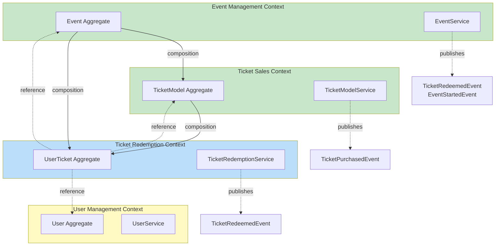

# Resumo Executivo - Arena.PE: DDD e Clean Architecture

## 📋 Sumário Executivo

Este documento apresenta a análise completa do backend Arena.PE sob a perspectiva de **Domain-Driven Design (DDD)** e **Clean Architecture**, com foco em subdomínios, bounded contexts, agregados, eventos de domínio e estrutura de camadas.

---

## 1️⃣ SUBDOMÍNIOS (2-4 Subdomínios)

### Subdomínios Identificados

| # | Subdomínio | Tipo | Gerador de Receita |
|---|----------|------|:-:|
| 1 | **Event Management** | Core | ✅ |
| 2 | **Ticket Sales & Distribution** | Core | ✅ |
| 3 | **Event Discovery & Catalog** | Supporting | ❌ |
| 4 | **User & Authentication** | Supporting | ❌ |

**Explicação:**
- **Event Management + Ticket Sales**: Core business (geram receita diretamente via venda de ingressos)
- **Event Discovery + User Auth**: Supporting (essenciais mas não monetizam diretamente)

---

## 2️⃣ BOUNDED CONTEXTS

### Mapeamento de Contextos com Significado de "Cliente"

#### Context 1: **Event Management Context**
```
Responsabilidade: Criar, publicar e gerenciar eventos
Cliente: EVENT OWNER (Organizador/Promotor)
Significado: Pessoa que cria e controla o evento
Operações: createEvent, updateEvent, publishEvent, cancelEvent
```

#### Context 2: **Ticket Sales Context**
```
Responsabilidade: Gerenciar modelos de ingresso e venda
Cliente: TICKET BUYER (Comprador/Cliente)
Significado: Pessoa que compra ingressos
Operações: createTicketModel, purchaseTicket, reserveTicket
```

#### Context 3: **Ticket Redemption Context**
```
Responsabilidade: Validar e consumir ingressos no evento
Cliente: EVENT ATTENDEE (Participante)
Significado: Pessoa presente no evento
Operações: redeemTicket, validateTicket, cancelTicket
```

#### Context 4: **User Management Context**
```
Responsabilidade: Autenticação e autorização
Cliente: SYSTEM USER (Usuário do Sistema)
Significado: Qualquer pessoa com acesso (múltiplos papéis)
Operações: registerUser, authenticate, authorizeAccess
```

---

## 3️⃣ AGREGADOS COM INVARIANTES

### Agregado: EVENT
```
RAIZ: Event
ENTIDADES FILHAS: TicketModel, UserTicket
INVARIANTES:
✓ eventDate > now() (data no futuro)
✓ title unique e válido [3-150 caracteres]
✓ creator NOT NULL
✓ status transitions válidas
✓ Mínimo 1 TicketModel para publicar
✓ CANCELED → todos tickets cancelados
```

### Agregado: TICKET MODEL
```
RAIZ: TicketModel
ENTIDADES FILHAS: UserTicket
INVARIANTES:
✓ price > 0
✓ ticketsAvailable ≥ 1
✓ ticketsSold ≤ ticketsAvailable
✓ location (PISTA|VIP|CAMAROTE) unique por evento
✓ Preço NOT muda após venda iniciada
✓ Event status = UPCOMING
```

### Agregado: USER TICKET
```
RAIZ: UserTicket
ENTIDADES FILHAS: -
INVARIANTES:
✓ user/event/ticketModel NOT NULL
✓ status inicial = VALIDO
✓ Transições: VALIDO → RESGATADO|CANCELADO|EXPIRADO
✓ SÓ resgatado UMA VEZ
✓ RESGATADO ∧ CANCELADO mutuamente exclusivos
✓ Não pode transferir entre users
```

### Agregado: USER
```
RAIZ: User
ENTIDADES FILHAS: Event[], UserTicket[]
INVARIANTES:
✓ email unique e valid
✓ password hashed (nunca plain-text)
✓ role ∈ {CUSTOMER, ADMIN}
✓ Um user = um role
✓ Apenas ADMIN pode certos ops
```

---

## 4️⃣ EVENTOS DO DIA DO SHOW (3 Eventos)

### Evento 1: **EventStartedEvent** ⏰ 14:00
```
Publisher: EventService
Consumers: TicketRedemptionService, Analytics, Notification
Payload: eventId, title, startedAt, location, expectedDuration
Ações:
└─ Inicia validação de ingressos na entrada
└─ Começa rastreamento de presença
└─ Notifica participantes
```

### Evento 2: **TicketRedeemedEvent** 🎫 Contínuo
```
Publisher: TicketRedemptionService
Consumers: Analytics, GateAccess, Notification
Payload: ticketId, userId, eventId, sectorLocation, redeemedAt
Ações:
└─ Atualiza status para RESGATADO
└─ Incrementa contador de presença
└─ Atualiza taxa de ocupação por setor
└─ Permite entrada na catraca
└─ Registra horário de entrada
```

### Evento 3: **EventEndedEvent** 🔚 23:59
```
Publisher: EventService
Consumers: TicketRedemption, Analytics, Reporting, Notification
Payload: eventId, title, endedAt, totalAttendees, totalReceived, occupancyRate
Ações:
└─ Encerra validação de ingressos
└─ Marca não-resgatados como EXPIRADO
└─ Calcula relatório final (attendance, receita)
└─ Gera report para organizador
└─ Envia agradecimento aos participantes
```

---

## 5️⃣ TABELA RESUMIDA DE DOMAIN EVENTS

| # | Evento | Publicador | Consumidores | Timing |
|---|--------|-----------|--------------|--------|
| 1 | EventCreatedEvent | EventService | Analytics, Notification | Imediato |
| 2 | EventStartedEvent | EventService | Tickets, Analytics, Notification | 14:00 |
| 3 | TicketPurchasedEvent | TicketSalesService | Analytics, Notification | Imediato |
| 4 | TicketRedeemedEvent | TicketRedemptionService | Analytics, Access, Notification | Contínuo |
| 5 | TicketCancelledEvent | TicketRedemptionService | Analytics, Notification | On-demand |
| 6 | EventEndedEvent | EventService | Tickets, Analytics, Reporting, Notification | 23:59 |

---

## 6️⃣ CLEAN ARCHITECTURE - ESTRUTURA DE CAMADAS

### Visão em 4 Camadas

```
┌─────────────────────────────────────────────────┐
│  PRESENTATION (Controllers, DTOs, REST APIs)    │
│  ↓ HTTP Requests / DTO Mapping                  │
├─────────────────────────────────────────────────┤
│  APPLICATION (Use Cases, Services)              │
│  ↓ Business Logic Coordination                  │
├─────────────────────────────────────────────────┤
│  DOMAIN (Entities, Aggregates, Services)        │
│  ↓ Business Rules & Invariants                  │
├─────────────────────────────────────────────────┤
│  INFRASTRUCTURE (Repositories, DB, Security)    │
│  ↓ Data Persistence & External Integrations    │
└─────────────────────────────────────────────────┘
```

### Mapeamento de Responsabilidades

| Camada | Responsabilidades | Spring Beans |
|--------|------------------|-------------|
| **Presentation** | Receber requests, validar formato, mapear DTOs | @RestController, @RequestMapping |
| **Application** | Orquestrar use cases, coordenar domínio | @Service, @Transactional |
| **Domain** | Aplicar regras de negócio, manter invariantes | @Entity, Domain Services |
| **Infrastructure** | Persistir dados, integrar sistemas externos | @Repository, @Component |

---

## 7️⃣ ESTRUTURA DE PASTAS - CLEAN ARCHITECTURE

### Organização Proposta

```
arena-pe-backend/
│
├── presentation/
│   ├── controllers/
│   │   ├── EventController.java
│   │   ├── TicketController.java
│   │   ├── UserController.java
│   │   └── StatisticsController.java
│   ├── dto/
│   │   ├── event/      (CreateEventRequest, EventResponse)
│   │   ├── ticket/     (TicketRequest, TicketResponse)
│   │   ├── user/       (RegisterForm, LoginRequest)
│   │   └── statistics/ (StatisticsDTO)
│   └── mappers/        (EventMapper, TicketMapper, etc)
│
├── application/
│   ├── event/
│   │   ├── CreateEventService.java
│   │   ├── UpdateEventService.java
│   │   └── GetEventsService.java
│   ├── tickets/
│   │   ├── model/      (CreateTicketModelService)
│   │   └── user/       (AssignUserTicketsService, ConsumeUserTicketService)
│   ├── auth/           (AuthenticationService)
│   ├── category/       (CategoryService)
│   └── statistics/     (AnalyticsService)
│
├── domain/
│   ├── models/
│   │   ├── event/      (Event.java, EventStatus.java, Category.java)
│   │   ├── ticket/     (TicketModel.java, UserTicket.java, TicketStatus.java)
│   │   └── user/       (User.java, Role.java)
│   ├── services/       (ICreateEvent, IAssignUserTickets, etc)
│   ├── events/         (EventCreatedEvent, TicketRedeemedEvent, etc)
│   └── repositories/   (IEventRepository, ITicketRepository, etc)
│
└── infrastructure/
    ├── repositories/   (EventRepository, TicketRepository - Implementações)
    ├── persistence/    (JPA Config, SQL schemas)
    ├── security/       (SecurityConfig, JwtTokenProvider)
    ├── external/       (EmailService, PaymentService, FileStorageService)
    ├── messaging/      (DomainEventPublisher, EventListener)
    └── config/         (ApplicationConfig, JpaConfig)
```

---

## 8️⃣ FLUXO EXEMPLO: CRIAR EVENTO

```
1. PRESENTATION
   EventController.createEvent(CreateEventRequest)
   └─ Valida formato JSON
   └─ Mapeia DTO para comando

2. APPLICATION
   CreateEventService.create()
   └─ Validações de negócio
   └─ Chama domain service

3. DOMAIN
   Event.new()
   └─ Valida invariantes
   └─ Cria agregado
   └─ Publica EventCreatedEvent

4. APPLICATION
   eventRepository.save(event)
   eventPublisher.publish(events)

5. INFRASTRUCTURE
   EventRepository.save()
   └─ Persiste em PostgreSQL
   
   EventPublisher
   └─ AnalyticsListener.onEventCreated()
   └─ NotificationListener.onEventCreated()

6. PRESENTATION
   Retorna EventResponse 201 CREATED
```

---

## 9️⃣ MATRIZ RACI - QUEM FAZ O QUÊ

| Atividade | Presentation | Application | Domain | Infrastructure |
|-----------|:---:|:---:|:---:|:---:|
| Receber Request HTTP | **R** | - | - | - |
| Validar DTO | **A** | S | - | - |
| Aplicar Regra de Negócio | - | - | **R** | - |
| Persistir Dados | - | - | - | **R** |
| Publicar Events | - | C | **R** | E |
| Autenticação | - | C | - | **E** |

*R=Responsible, A=Accountable, C=Consulted, E=Execute, S=Support*

---

## 🔟 DIAGRAMA: BOUNDED CONTEXTS



---

## 1️⃣1️⃣ REGRAS DE NEGÓCIO CRÍTICAS

### Event Context
- ✓ Evento só criado por User autenticado
- ✓ Data do evento deve ser no futuro
- ✓ Título deve ser único
- ✓ Evento precisa ≥1 TicketModel antes de publicar
- ✓ Não pode editar após ter começado

### Ticket Sales Context
- ✓ Preço SEMPRE > 0
- ✓ Não pode vender mais que disponível
- ✓ Preço NÃO muda após primeira venda
- ✓ Cada setor é único por evento
- ✓ Quando vendido = ticketsSold, setor está SOLD OUT

### Ticket Redemption Context
- ✓ Ingresso resgatado SÓ UMA VEZ
- ✓ Cancelamento: owner OU admin
- ✓ Cancelamento → reembolso automático
- ✓ Ingresso expirado após evento terminar
- ✓ Auditoria completa de mudanças

### User Management Context
- ✓ Email UNIQUE e válido
- ✓ Senha SEMPRE hashed (nunca plain-text)
- ✓ Novo user = role CUSTOMER (default)
- ✓ Apenas ADMIN promove outro a ADMIN

---

## 1️⃣2️⃣ COMO TUDO SE CONECTA NO SPRING BOOT

### Anotações utilizadas

| Camada | Anotação | Uso |
|--------|----------|-----|
| Presentation | @RestController, @RequestMapping, @PostMapping | Controllers |
| Application | @Service, @Transactional | Use Cases |
| Domain | @Entity, Domain Services (interfaces) | Entidades |
| Infrastructure | @Repository, @Component, @Configuration | Implementações |

### Exemplo Real

```java
// PRESENTATION
@RestController
public class EventController {
    @PostMapping("/api/events")
    public ResponseEntity<EventResponse> create(@Valid @RequestBody CreateEventRequest req) {
        return ResponseEntity.ok(createEventService.create(req));
    }
}

// APPLICATION
@Service
public class CreateEventService {
    @Transactional
    public EventResponse create(CreateEventRequest req) {
        Event event = new Event(...);  // Domain
        eventRepository.save(event);    // Infrastructure
        eventPublisher.publish(event.getDomainEvents());
        return eventMapper.toResponse(event);
    }
}

// DOMAIN
@Entity
public class Event {
    @NotNull private String title;
    @Future private LocalDateTime eventDate;
    // Invariantes protegidas em getters/setters
}

// INFRASTRUCTURE
@Repository
public interface EventRepository extends JpaRepository<Event, UUID> {
    Optional<Event> findByTitle(String title);
}
```

---

## 1️⃣3️⃣ CONCLUSÃO

O Arena.PE possui uma excelente estrutura fundacional com:

✅ **Bounded Contexts claros**: Event Mgmt, Ticket Sales, Redemption, User Mgmt  
✅ **Agregados bem definidos**: Event, TicketModel, UserTicket, User  
✅ **Domain Events**: 6+ eventos cobrindo lifecycle completo  
✅ **Clean Architecture**: 4 camadas bem segregadas  
✅ **Spring Boot Integration**: Padrões corretos de implementação  

### Recomendações para evolução:

1. **Explicitar Value Objects**: Price, Email, Sector (não apenas enums)
2. **Implementar Event Sourcing**: Para auditoria completa de tickets
3. **Aplicar Strategy Pattern**: Para diferentes tipos de promoções
4. **Segregar por módulos Maven**: Um módulo por BC
5. **Testes de invariantes**: Unit tests para cada agregado
6. **CQRS opcional**: Para queries de analytics pesadas

---

## 📚 Referências & Documentos Complementares

- [ANALISE_DDD_CLEAN_ARCHITECTURE.md](../ANALISE_DDD_CLEAN_ARCHITECTURE.md) - Análise completa
- [DIAGRAMAS_E_ESTRUTURA.md](../DIAGRAMAS_E_ESTRUTURA.md) - Diagramas Mermaid & estrutura detalhada

---

**Documento Versão**: 1.0  
**Data**: Junho 2024  
**Projeto**: Arena.PE  
**Framework**: Spring Boot 4.0.5 / Java 25  
**Banco de Dados**: PostgreSQL  

